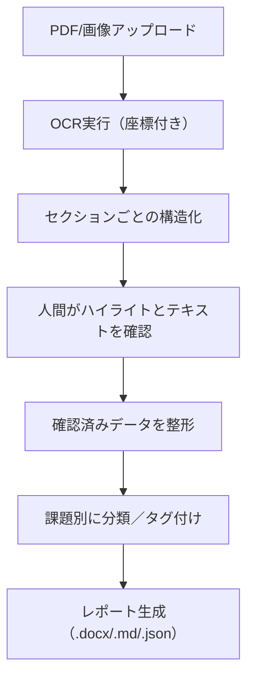

# 改善提案シート OCR システム - 要求分類

## 0. データ構造・検証アプローチ

### 0.1 データ構造の理解

- **1by1 ディレクトリ**: 一セクションずつ切り出されたもの

  - 各画像は改善提案シートの個別セクション
  - 4 つのサンプル画像あり（Screenshot 2025-05-24 at 18.22.xx.png）
  - 単一セクションでの OCR 精度検証に最適

- **1person ディレクトリ**: 参加者 1 人から受け取った手書き資料をそのままスクリーンショット

  - 1 つのサンプル画像（Screenshot 2025-05-28 at 15.44.19.png）
  - 複数セクションが含まれた実際の使用形態
  - セクション分割アルゴリズムの検証に使用

- **改善提案シート PDF**: 最終的な処理対象
  - 複数の参加者分が連なったもの
  - 最終目標：PDF を投げて処理できるシステム

### 0.2 段階的検証アプローチ

1. **Phase 1**: 1by1 データでの単一セクション OCR 精度検証
2. **Phase 2**: 1person データでの複数セクション分割・処理検証
3. **Phase 3**: 完全な PDF 処理システムの構築

## 1. OCR 精度向上・可視化機能

### 1.1 読み取り箇所のハイライト表示

- **要求**: アップロードしたファイルのうち、読み取りに利用した箇所をハイライト表示
- **目的**: 読み取り間違えがあっても気付きやすくする
- **技術的課題**: 画像のどの座標から読み取ったかというデータが必要
- **参考**: Google Document AI の OCR 可視化機能が理想的

### 1.2 座標データ取得の検証

- **要求**: ChatGPT で座標データ取得が可能か検証
- **代替案**: Google Document AI の利用を検討（bounding box 情報あり）
- **技術要件**: 画像座標（bounding box）情報が必須

## 2. OCR 結果の修正・補正機能

### 2.1 テキスト修正インターフェース

- **要求**: OCR 結果をテキストファイルとして訂正可能にする
- **UI 要件**:
  - **クリック選択**: 修正したい OCR 結果をクリックして選択
  - **修正候補提示**: 選択形式で修正候補を提示
  - **フリーテキスト入力**: 手入力も受け入れる
- **提供形式**: Web UI として提供

### 2.2 人間による補正システム

- **要求**: OCR 結果を人間が補正する仕組み
- **機能**:
  - 画像/PDF の読み取り部分をハイライト
  - ハイライトと OCR 結果を紐づけ
  - どこを読み取った結果なのかを確認しやすくする
- **参考**: Google Document AI の可視化機能と同様の UX

## 3. ファイル形式対応

### 3.1 マルチフォーマット対応

- **要求**: 画像でも PDF でも問題なく処理できるようにする
- **対象フォーマット**:
  - 画像ファイル（JPG/PNG）
  - PDF ファイル（1 ページ／複数ページ）
- **特記事項**: 各ページに「記載例 + 複数セクション」が混在する可能性

## 4. データ構造・整理機能

### 4.1 複数セクション対応

- **現状**: 一つのセクションを切り抜いた画像を処理
- **要求**: 「記載例」+複数のセクションが含まれた改善提案シートに対応
- **機能**: 各課題ごとに整理して表示
- **構造的特徴**:
  - 同じ質問が繰り返されている
  - 各セクションには placeholder（項目）がある
  - 人間が項目に対して手書きで回答する形式
  - レイアウト的な区切りは明示されていないが、判断は比較的容易

### 4.2 セクション構造化

- **要求**: 段落・セクションごとに区切って読み取り
- **期待される構造**: 「課題」「提案」「対象（行政／住民など）」
- **処理方針**: 定型ラベルと自然文の混在に対応

## 5. OCR サービス選定・精度向上

### 5.1 OCR サービス比較検討

- **候補サービス**:
  - **ChatGPT**: 座標情報なし、画像からの処理に制限あり
  - **Google Document AI**: 日本語手書き対応、bounding box あり（推奨）
  - **Mistra OCR**: 精度未知、日本語手書き対応次第
- **対象**: 日本語手書き文字の読み取り（精度のばらつきあり）

### 5.2 データセット活用検討

- **利用可能データ**: 構想日本の改善提案シートのデータセット（過去に担当者が目視で書き起こしたもの）
- **活用方法**: Ground truth としてデータセット使用を検討
- **検討事項**: 現フェーズで精度向上を図るか、後のフェーズで対応するか
- **方針**: まずプロトタイピング優先、後で精度チューニング

## 6. 処理フロー・自動化要件

### 6.1 処理フロー

### 6.2 自動化範囲

- **要求**: OCR + 整形 + 課題抽出 + レポート出力まで自動化
- **出力目的**:
  - 各課題を一意に取り出し、再構成（カテゴリ・提案対象別）
  - 最終的には提案書・中間とりまとめに変換

## 実装優先度

### Phase 1: 単一セクション OCR 検証（1by1 データ使用）

1. 基本的な OCR 機能（Google Document AI 推奨）
2. 座標データ付きハイライト表示
3. Web UI でのテキスト修正インターフェース
4. ファイル形式対応（画像・PDF）

### Phase 2: 複数セクション処理検証（1person データ使用）

1. セクション自動分割・構造化
2. 複数セクション対応
3. 修正候補の自動提示機能
4. 課題別分類・タグ付け機能

### Phase 3: 完全 PDF 処理システム（最終目標）

1. 複数参加者分の一括処理
2. レポート自動生成機能
3. データセットを活用した精度向上
4. 高度な補正機能

## 技術選択肢

### プロトタイプ案 A: ChatGPT ベース

- ChatGPT ベースで画像 →OCR→ 人力補正 UI 付き確認ツール
- **制限**: 座標情報なし、ハイライト機能に制約
- **適用**: Phase 1 での基本機能検証に使用可能

### プロトタイプ案 B: Google Document AI ベース（推奨）

- Google Document AI を活用して bounding box 付き OCR 結果を処理・可視化
- **利点**: 座標情報あり、日本語手書き対応、理想的なハイライト機能
- **適用**: 全 Phase を通じて推奨、特に Phase 2 以降で必須

### 検証データの活用方針

- **Phase 1**: `kaizen_teian_sheets/1by1/` の 4 つの画像で単一セクション OCR 精度を検証
- **Phase 2**: `kaizen_teian_sheets/1person/` の画像で複数セクション分割・処理を検証
- **Phase 3**: 実際の PDF ファイルでの統合処理を検証

## 追加確認事項

### A. 改善提案シートの構造

- ✅ 複数の「課題／提案」が 1 ページに混在、レイアウト的区切りなし
- ✅ 各セクションには placeholder（項目）あり、手書き回答形式

### B. 補正ツールの要件

- ✅ Web UI として提供
- ✅ クリック選択 + 修正候補提示 + フリーテキスト入力

### C. モデル検証・導入順

- 推奨: Google Document AI ベースでの実装を優先
- ChatGPT ベースは座標情報の制限により補助的位置づけ
